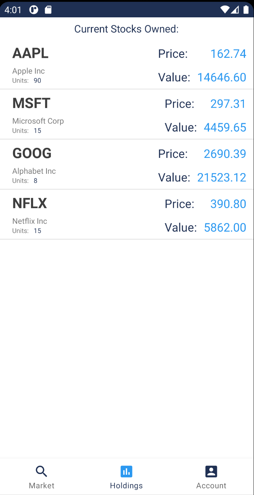

# PaperTrader

## Overview

PaperTrader is a full-stack stock trading Android app developed with Android Studio, Flask, and PostgreSQL. For a video demonstration, go to:

## Images

  
Front-End Images

  
  
  
  
  
  
  

