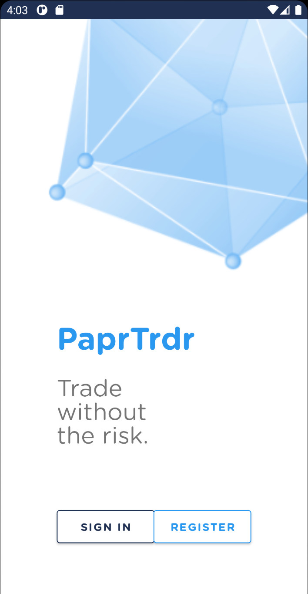
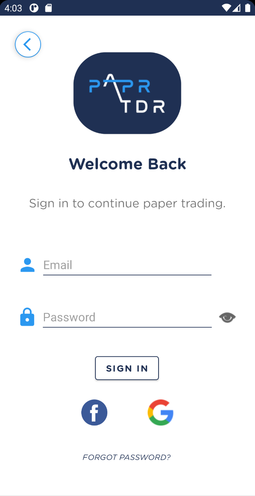
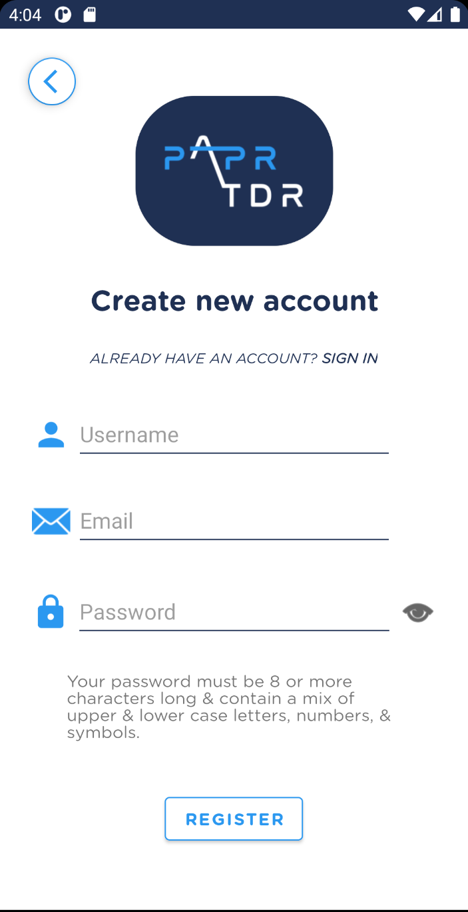
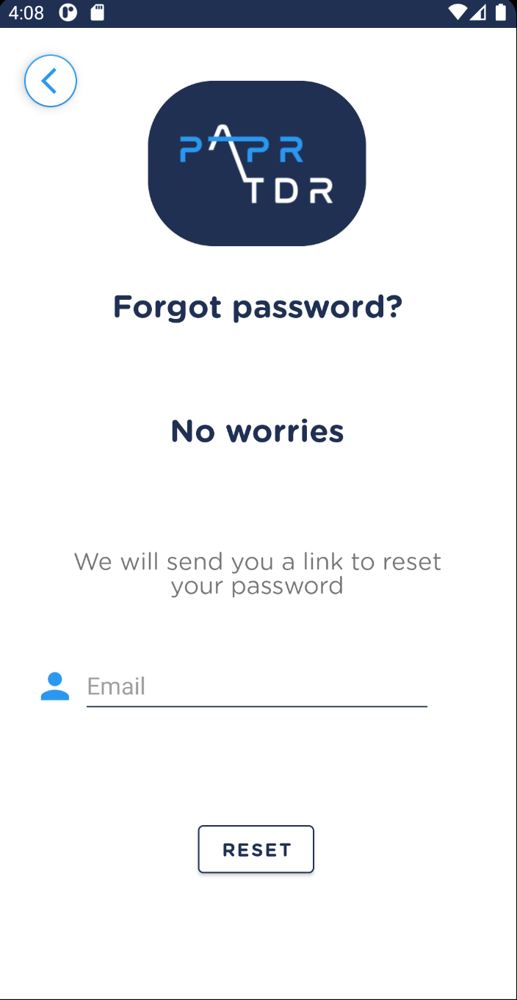
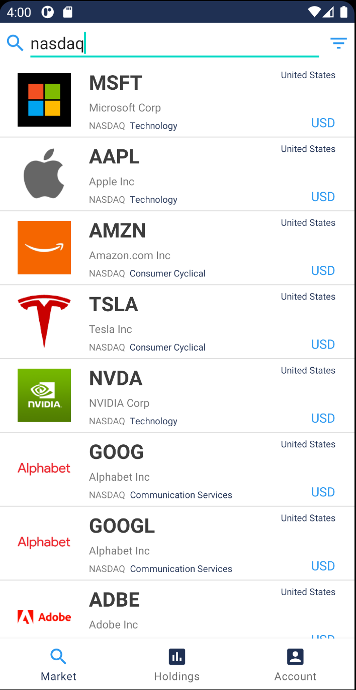
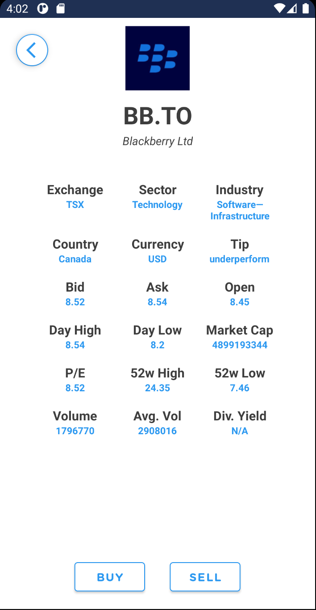

# PaperTrader

## Overview

PaperTrader is a full-stack stock trading Android app developed with Android Studio, Flask, and PostgreSQL. For a video demonstration, click [here](https://youtu.be/x_4-cD0MXds)

## Images

  
Landing Page

  

  
Login

  

  
Register

  

  
Forgot Password

  

  
Market Tab

  

  
Stock Page

  

